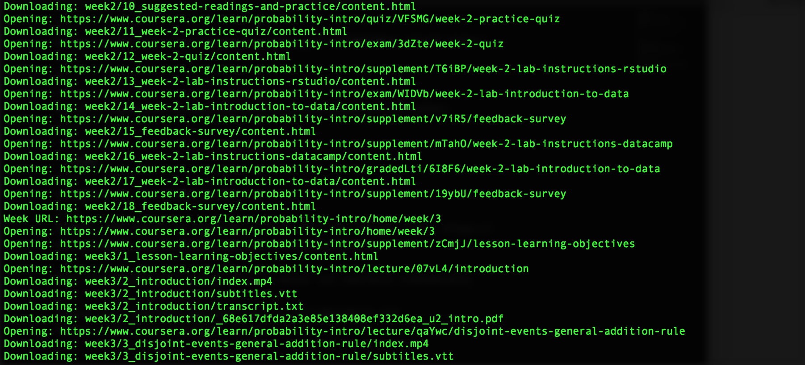
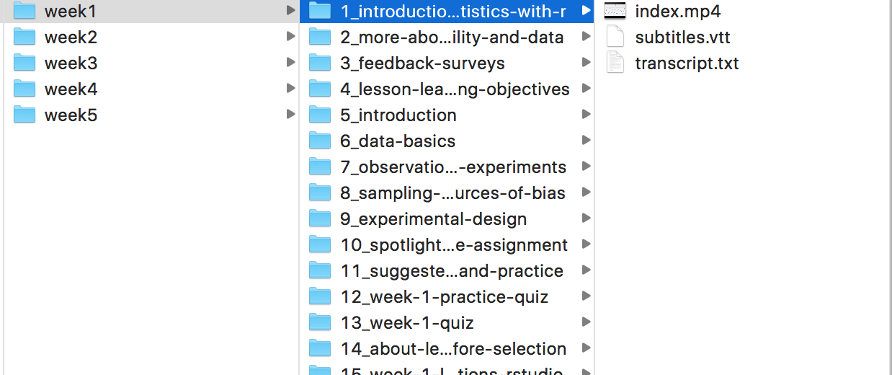

# coursera_scrapper

A simple scrapper for the couse materails from Coursera. 

# Configuration
Please change the executable_path to your [Chrome](https://sites.google.com/a/chromium.org/chromedriver/)/[PhantomJS](http://phantomjs.org/download.html) driver executable path.
~~~~
driver = webdriver.PhantomJS(executable_path=<PHANTOMJS_DRIVER_PATH>)
~~~~
or
~~~~
driver = webdriver.Chrome(executable_path=<CHROME_DRIVER_PATH>)
~~~~

# Usage
~~~~
scrapper.py -s <COURSE_LINK>
~~~~
COURSE_LINK should be the page of week 1 of the course, e.g.: https://www.coursera.org/learn/probability-intro/home/week/1

Then the script will prompt user to enter its coursera credientals:
~~~~
Please your coursera username(email): billy@example.com
Please enter your password: ******
~~~~

Scraping in progress

Results

# Note
I wrote this as an execrise and it is my first scrapper. Yeah!!! Please free free to comment and if you find this script useful, it will be wonderfu if you can let me know. Thanks in advance:thumbsup: